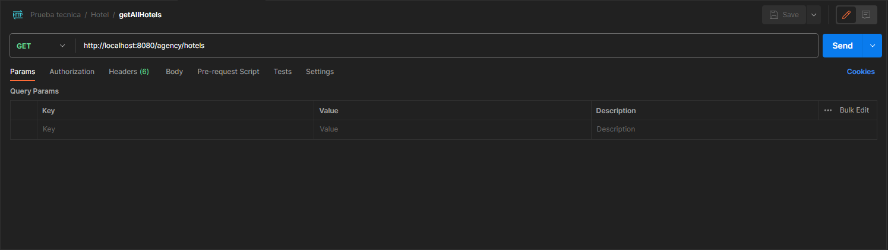

# API para Gestión de Reservas en Hoteles y Vuelos

Esta API está especialmente diseñada para facilitar la gestión eficiente de hoteles, habitaciones y vuelos. Su propósito principal es permitir la realización de reservas tanto de habitaciones de hotel como de vuelos de manera sencilla y rápida, manteniendo a su vez un registro detallado de los usuarios que efectúan estas reservas.

## Funcionalidades Principales

### Gestión de Hoteles
- **Agregar nuevos hoteles:**
    - Permite la incorporación de nuevos hoteles en el sistema.
- **Listar hoteles existentes:**
    - Facilita la visualización de todos los hoteles disponibles.
- **Actualizar información de hoteles:**
    - Posibilita la modificación de datos de hoteles ya registrados, siempre y cuando no tengan reservas asignadas.
- **Eliminar hoteles:**
    - Ofrece la opción de retirar hoteles del sistema, siempre y cuando no tengan reservas asignadas.
- **Búsqueda personalizada de hoteles:**
    - Permite a los usuarios realizar búsquedas avanzadas de hoteles basadas en criterios específicos como rango de fechas, ubicación y disponibilidad.

#### Endpoints de Hotel-Controller
- **PUT /agency/hotels/edit/{id}:**
    - Para editar la información de un hotel mediante su ID.
- **POST /agency/hotels/new:**
    - Para registrar un nuevo hotel en el sistema.
- **GET /agency/hotels:**
    - Para obtener un listado completo de todos los hoteles.
- **GET /agency/hotels/{id}:**
    - Para encontrar un hotel específico utilizando su ID.
- **DELETE /agency/hotels/delete/{id}:**
    - Para eliminar hotel con un ID especifico.
- **GET /agency/hotels/search:**
    - Para buscar hoteles aplicando filtros como rango de fechas, ubicación y disponibilidad.

---

### Gestión de Vuelos
- **Agregar nuevos vuelos:**
    - Permite la incorporación de nuevos vuelos en el sistema.
- **Listar vuelos existentes:**
    - Facilita la visualización de todos los vuelos disponibles.
- **Actualizar información de vuelos:**
    - Posibilita la modificación de datos de vuelos ya registrados, siempre y cuando no tengan reservas asignadas.
- **Eliminar vuelos:**
    - Ofrece la opción de retirar vuelos del sistema, siempre y cuando no tengan reservas asignadas.
- **Búsqueda personalizada de vuelos:**
    - Permite a los usuarios realizar búsquedas avanzadas de vuelos basadas en criterios específicos como fecha, origen y destino.

#### Endpoints de Flight-Controller
- **PUT /agency/flights/edit/{id}:**
    - Para modificar los detalles de un vuelo usando su ID.
- **POST /agency/flights/new:**
    - Para añadir un nuevo vuelo al sistema.
- **GET /agency/flights:**
    - Para ver todos los vuelos disponibles.
- **GET /agency/flights/{id}:**
    - Para buscar un vuelo específico por ID.
- **DELETE /agency/flights/delete/{id}:**
- Para eliminar hotel con un ID especifico.
- **GET /agency/flights/search:**
    - Para buscar vuelos con filtros como fecha, origen y destino.

---

### Gestión de Habitaciones
- **POST /agency/rooms/new:**
    - Para crear una nueva habitación en un hotel.

---

### Gestión de Reservas de Hotel
- **POST /agency/hotel-booking/new:**
    - Para realizar una reserva de hotel.
- **GET /agency/hotel-booking/all:**
    - Para ver todas las reservas de hoteles.
- **DELETE /agency/hotel-booking/delete/{id}:**
    - Para eliminar una reserva de hotel por Id.

---

### Gestión de Reservas de vuelos
- **POST /agency/flight-booking/new:**
    - Para efectuar una reserva de vuelo.
- **GET /agency/flight-booking/all:**
    - Para ver todas las reservas de vuelos.
- **DELETE /agency/flight-booking/delete/{id}:**
    - Para eliminar una reserva de vuelo por Id.

--------------------------------

## Uso de la Aplicación

### Gestión de Hoteles

---

#### Pasos para Editar la Información de un Hotel

1. **Identificar el ID del Hotel:**

   Obtén el ID del hotel que deseas editar. Este ID es un identificador único asignado a cada hotel en tu sistema.

2. **Incluir Parámetros de Edición:**

   Incluye en la solicitud los parámetros que deseas modificar:

- `name`: El nuevo nombre del hotel.
- `place`: La nueva ubicación del hotel.


3. **Enviar la Solicitud:**

   Realiza una solicitud HTTP de tipo PUT al endpoint `/agency/hotels/edit/{id}`, donde `{id}` se reemplaza con el
   identificador único del hotel que deseas editar. `http://localhost:8080/agency/hotels/edit/1`

- Si no encuentra el id del hotel, mostrará un mensaje de `Hotel not found with the provided ID`.
- El servidor debería responder con una confirmación de que el hotel ha sido modificado, devolviendo el mensaje 
  `Hotel successfully updated`.
- Para modificar datos de un hotel, primero deberás estar autenticado. Además, si el hotel ya dispone de reservas,
  no se podrá realizar la modificación y se mostrará el mensaje `Hotel cannot be modified because it has bookings`.

4. **Verificación Opcional:**

   Después de recibir la respuesta, podrías querer verificar que el vuelo ha sido actualizado correctamente. Esto se puede hacer mediante una solicitud GET al endpoint específico del vuelo (`/agency/hotels/{id}`) y comparar los detalles actualizados.


---

#### Pasos para Registrar un Nuevo Hotel

1. **Preparar la Solicitud:**

- Para añadir un nuevo hotel en el sistema, necesitarás preparar una solicitud POST dirigida al
  endpoint `/agency/hotels/new`.

2. **Incluir Datos del Hotel en el JSON:**

- En el cuerpo de la solicitud, incluye los detalles del nuevo hotel en formato JSON. Por ejemplo:

   ```json
   {
     "name": "Hilton",
     "place": "Barcelona"
   }
   ```

- `name`: El nombre del nuevo hotel.
- `place`: La ubicación del nuevo hotel.

3. **Enviar la Solicitud:**

- Envía la solicitud POST con el cuerpo del JSON al servidor.

- Hay que estar autenticado para realizar la solicitud.

4. **Manejar la Respuesta:**

- El servidor debería responder con una confirmación de que el hotel ha sido agregado, posiblemente devolviendo el
  mensaje `Hotel successfully created`.
- Si ocurre algún error (por ejemplo, datos faltantes o inválidos), el servidor debería proporcionar un mensaje de
  error adecuado.


---

#### Pasos para Obtener un Listado Completo de Todos los Hoteles

1. **Preparar la Solicitud:**

   Prepara una solicitud GET dirigida al endpoint `/agency/hotels`. Este tipo de solicitud se utiliza para recuperar
   datos y no requiere un cuerpo de solicitud.

2. **Enviar la Solicitud:**

   Envía la solicitud GET al servidor.

3. **Recibir y Procesar la Respuesta:**

- El servidor responderá con una lista de todos los hoteles disponibles en el sistema.
- Si no se encontrara una lista de todos los hoteles disponibles, se mostrará un mensaje de `No registered hotels found`.



---

#### Pasos para Obtener la Información de un Hotel Específico

1. **Identificar el ID del Hotel:**

   Determina el ID del hotel cuya información deseas obtener. En tu ejemplo, el ID es 2.

2. **Preparar la Solicitud:**

   Prepara una solicitud GET dirigida al endpoint `/agency/hotels/{id}`, reemplazando `{id}` con el ID del hotel. En tu
   ejemplo, la URL completa sería

   ```
   http://localhost:8080/agency/hotels/2
   ```


3. **Enviar la Solicitud:**

   Envía la solicitud GET al servidor.

4. **Recibir y Procesar la Respuesta:**

- El servidor responderá con los detalles del hotel solicitado.
- Si no se encuentra el ID proporcionado, devolverá un mensaje de `There are no hotels registered with that ID`.
- La respuesta generalmente estará en formato JSON.


---

### Pasos para Eliminar un Hotel Específico

1. **Identificar el ID del Hotel:**

   Asegúrate de tener el ID del hotel que deseas eliminar. Este ID es un identificador único asignado a cada hotel.

2. **Preparar la Solicitud:**

   Prepara una solicitud DELETE dirigida al endpoint `/agency/hotels/delete/{id}`, sustituyendo `{id}` por el
   identificador del hotel que quieres eliminar por ejemplo

   ```
   http://localhost:8080/agency/hotels/delete/2
   ```

3. **Enviar la Solicitud:**

  - Realiza la solicitud DELETE al servidor.

  - Hace falta estar autenticado para borrar la información del hotel.

4. **Manejar la Respuesta:**

   Después de enviar la solicitud, el servidor responderá con uno de los siguientes mensajes:

- Si el hotel ha sido eliminado exitosamente, el servidor debería responder con el mensaje `Hotel successfully deleted`.

- Si el hotel no existe, el servidor debería devolver el mensaje `There are no hotels registered with that ID`.

- Si no se puede eliminar el hotel debido a reservas existentes, el servidor debería devolver el mensaje `Hotel cannot be deleted because it has bookings`.


---

### Pasos para Buscar Hoteles con Filtros Específicos

1. **Definir los Criterios de Búsqueda:**

   Establece los criterios de búsqueda que deseas aplicar. En tu ejemplo, los criterios son:
- `place`: Ubicación del hotel, como "Miami".
- `disponibilityDateFrom`: Fecha de inicio de la disponibilidad, por ejemplo, "2024-02-10".
- `disponibilityDateTo`: Fecha de fin de la disponibilidad, por ejemplo, "2024-03-23".
- `isBooked`: Estado de la reserva del hotel, en este caso, "false" para hoteles no reservados.

2. **Preparar la Solicitud:**

   Prepara una solicitud GET dirigida al endpoint `/agency/hotels/search` e incluye los parámetros de búsqueda en la
   URL. En tu caso, la URL sería:

   ```
   http://localhost:8080/agency/hotels/search?place=Miami&disponibilityDateFrom=2024-02-10&disponibilityDateTo=2024-03-23&isBooked=false
   ```

3. **Enviar la Solicitud:**

   Realiza la solicitud GET al servidor.


4. **Recibir y Procesar la Respuesta:**

   El servidor responderá con una lista de hoteles que coinciden con los criterios de búsqueda proporcionados.

- Si no se encuentra ningún hotel que cumpla con los filtros, el servidor debería devolver el mensaje `No registered hotels found`.

- La respuesta generalmente estará en formato JSON e incluirá detalles de los hoteles que cumplen con los filtros
  aplicados.


----------------------------------------------------------------

### Gestión de Vuelos

---

### Pasos para Modificar los Detalles de un Vuelo


1. **Preparar la Solicitud:**

   Prepara una solicitud PUT dirigida a `http://localhost:8080/agency/flights/edit/1`.

- Incluye en la solicitud los parámetros que deseas modificar:
    - `seatType`: Tipo de asiento, por ejemplo, "Bussines".
    - `flightPrice`: Precio del vuelo, por ejemplo, "500".
    - `date`: Fecha del vuelo, como "2024-03-15".

2. **Enviar la Solicitud:**

   Realiza la solicitud PUT al servidor, asegurándote de incluir la autenticación.

3. **Manejo de Respuestas y Errores:**

- Si el vuelo con el ID proporcionado no se encuentra, espera un mensaje de error del servidor: `Flight not found with the provided ID`.
- Si el vuelo no puede ser modificado debido a que ya tiene reservas, el servidor debería devolver un mensaje como: `Flight cannot be modified because it has bookings`.
- Si la solicitud es exitosa, recibirás una confirmación del servidor indicando que el vuelo ha sido modificado: `Flight successfully updated`.

5. **Verificación Opcional:**

   Después de recibir la respuesta, podrías querer verificar que el vuelo ha sido actualizado correctamente. Esto se puede hacer mediante una solicitud GET al endpoint específico del vuelo (`/agency/flights/{id}`) y comparar los detalles actualizados.


---

### Pasos para Añadir un Nuevo Vuelo

1. **Preparar la Solicitud:**

- Prepara una solicitud POST dirigida al endpoint `/agency/flights/new`.

2. **Incluir Datos del Nuevo Vuelo:**

- En el cuerpo de la solicitud, incluye los detalles del nuevo vuelo en formato JSON. Por ejemplo:

   ```json
   {
     "origin": "Cartagena",
     "destination": "Barcelona",
     "seatType": "Business",
     "flightPrice": 2573,
     "date": "2024-02-10"
   }
   ```

- Asegúrate de que todos los campos requeridos estén incluidos y sean correctos.

3. **Enviar la Solicitud:**

- Realiza la solicitud POST al servidor.

- Es necesario estar autenticado para realizar la operación.

4. **Manejar la Respuesta:**

- El servidor debería responder con una confirmación de que el vuelo ha sido agregado exitosamente. Espera un mensaje como `Successfully created flight`.

- Si hay algún error (por ejemplo, datos faltantes o inválidos), el servidor debería proporcionar un mensaje de error adecuado.


 

---


### Pasos para Ver Todos los Vuelos Disponibles

1. **Preparar la Solicitud:**

- Prepara una solicitud GET dirigida al endpoint `/agency/flights`.

2. **Enviar la Solicitud:**

- Realiza la solicitud GET al servidor.

3. **Manejar la Respuesta:**

- El servidor responderá con un listado de todos los vuelos disponibles.

- Si no hay vuelos registrados en el sistema, espera un mensaje como `No registered flights found`.

- La respuesta suele estar en formato JSON e incluirá detalles como el origen, destino, tipo de asiento, precio y fecha de cada vuelo.


---

### Pasos para Buscar un Vuelo Específico por ID

1. **Identificar el ID del Vuelo:**

- Asegúrate de tener el ID del vuelo que deseas consultar. En este caso, el ID es 1.

2. **Preparar la Solicitud:**

- Prepara una solicitud GET dirigida al endpoint `/agency/flights/{id}`, sustituyendo `{id}` con el ID del vuelo. Para tu ejemplo, la URL sería `http://localhost:8080/agency/flights/1`.

3. **Enviar la Solicitud:**

- Realiza la solicitud GET al servidor.

4. **Manejar la Respuesta:**

- Si el vuelo con el ID proporcionado existe, el servidor responderá con los detalles del vuelo. La información suele estar en formato JSON e incluye datos como origen, destino, tipo de asiento, precio y fecha.

- Si no hay ningún vuelo registrado con ese ID, el servidor debería devolver un mensaje como `There are no flights registered with that ID`.


---

### Pasos para Eliminar un Vuelo Específico

1. **Identificar el ID del Vuelo:**

- Asegúrate de tener el ID del vuelo que deseas eliminar. En este caso, el ID es 5.

2. **Preparar la Solicitud:**

- Prepara una solicitud DELETE dirigida al endpoint `/agency/flights/delete/{id}`, reemplazando `{id}` con el ID del vuelo. Para tu ejemplo, la URL sería `http://localhost:8080/agency/flights/delete/5`.

3. **Enviar la Solicitud:**

- Realiza la solicitud DELETE al servidor.

- Para poder eliminar hace falta autentificación.

4. **Manejo de Respuestas y Errores:**

- Si el vuelo con el ID proporcionado no se encuentra, espera un mensaje de error del servidor: `There are no flights registered with that ID`.

- Si el vuelo no puede ser eliminado debido a que ya tiene reservas, el servidor debería devolver un mensaje como: `Flight cannot be deleted because it has bookings`.

- Si la solicitud es exitosa y el vuelo se elimina correctamente, el servidor debería confirmar con un mensaje como: `Flight successfully deleted`.


---

### Pasos para Buscar Vuelos con Filtros Específicos

1. **Definir los Criterios de Búsqueda:**

- Establece los criterios de búsqueda que deseas aplicar. En tu ejemplo, los criterios son:
    - `origin`: Origen del vuelo, como "Barcelona".
    - `destination`: Destino del vuelo, como "Miami".
    - `date1`: Fecha de inicio para la búsqueda, por ejemplo, "2024-02-10".
    - `date2`: Fecha de fin para la búsqueda, por ejemplo, "2024-02-28".

2. **Preparar la Solicitud:**

- Prepara una solicitud GET dirigida al endpoint `/agency/flights/search` e incluye los parámetros de búsqueda en la URL. Utiliza tu ejemplo como guía para formatear la URL:

   ```
   http://localhost:8080/agency/flights/search?origin=Barcelona&destination=Miami&date1=2024-02-10&date2=2024-02-28
   ```

3. **Enviar la Solicitud:**

- Realiza la solicitud GET al servidor.

4. **Recibir y Procesar la Respuesta:**

- El servidor responderá con una lista de vuelos que coinciden con los criterios de búsqueda proporcionados.

- La respuesta generalmente estará en formato JSON e incluirá detalles de los vuelos que cumplen con los filtros aplicados, como horarios, precios y disponibilidad.


----------------------------------------------------------------

### Gestión de Habitaciones

### Pasos para Crear una Nueva Habitación en un Hotel

1. **Preparar la Solicitud:**

- Prepara una solicitud POST dirigida al endpoint `/agency/rooms/new`.

2. **Incluir Datos de la Nueva Habitación:**

- En el cuerpo de la solicitud, incluye los detalles de la nueva habitación en formato JSON. Por ejemplo:

   ```json
   {
     "roomType": "Single",
     "roomPrice": 390,
     "disponibilityDateFrom": "2024-02-23",
     "disponibilityDateTo": "2024-03-14",
     "hotel": {
       "id": 3
     }
   }
   ```

- Asegúrate de que todos los campos requeridos estén incluidos y sean correctos, especialmente el ID del hotel asociado al hotel.

3. **Enviar la Solicitud:**

- Realiza la solicitud POST al servidor.

- Hace falta estar autenticado para crear una nueva habitacion.

4. **Manejar la Respuesta:**

- Si la habitación se crea con éxito, el servidor debería responder con un mensaje como `The room has been successfully created`.

- Si no se encuentra un hotel con el ID proporcionado, espera un mensaje de error del servidor: `No hotel found with this ID`.

- Si hay otros errores (como datos faltantes o inválidos), el servidor debería proporcionar un mensaje de error adecuado.


----------------------------------------------------------------

### Gestión de Reservas de Hotel

### Pasos para Realizar una Reserva de Hotel

1. **Preparar la Solicitud:**

- Prepara una solicitud POST dirigida al endpoint `/agency/hotel-booking/new`.

2. **Incluir Datos de la Reserva:**

- En el cuerpo de la solicitud, incluye los detalles de la reserva en formato JSON. Por ejemplo:

   ```json
   {
     "dateFrom": "2024-02-10",
     "dateTo": "2024-03-19",
     "place": "Miami",
     "hotelCode": "ATMI-2946",
     "peopleQ": 2,
     "roomType": "Doble",
     "host": {
       "name": "Antonio",
       "lastName": "Perez Lopez",
       "email": "antonio@prueba.es",
       "passPort": "AB123456A",
       "age": 34
     }
   }
   ```

- Asegúrate de que todos los campos requeridos estén incluidos y sean correctos.

3. **Enviar la Solicitud:**

- Realiza la solicitud POST al servidor.

4. **Manejar la Respuesta:**

- Si la reserva no puede realizarse o si el usuario ya tiene una reserva para esas fechas y ese hotel, espera un mensaje de error del servidor: `The reservation could not be carried out or user already has a booking for this date and hotel, please check the reservation date`.

- Si la reserva se realiza con éxito, el servidor debería responder con el precio total de la reserva, algo como: `The total price of the reservation is: ****** €`.


---

#### Pasos para Ver Todas las Reservas de Hoteles

**Endpoint:** GET /agency/hotel-booking/all

1. **Preparar la Solicitud:**

    - Prepara una solicitud GET dirigida al endpoint `/agency/hotel-booking/all`. Este tipo de solicitud se utiliza para obtener una lista de todas las reservas de hoteles existentes.

2. **Enviar la Solicitud:**

    - Realiza la solicitud GET al servidor.
    - Hay que estar autenticado para acceder a la información de las reservas de hoteles.

3. **Recibir y Procesar la Respuesta:**

    - El servidor responderá con una lista de todas las reservas de hoteles registradas en el sistema.


---

#### Pasos para Eliminar una Reserva de Hotel por ID

**Endpoint:** DELETE /agency/hotel-booking/delete/{id}

1. **Identificar el ID de la Reserva:**

    - Asegúrate de tener el ID de la reserva de hotel que deseas eliminar.

2. **Preparar la Solicitud:**

    - Prepara una solicitud DELETE dirigida al endpoint `/agency/hotel-booking/delete/{id}`, reemplazando `{id}` con el ID de la reserva de hotel que deseas eliminar, en este caso `http://localhost:8080/agency/hotel-booking/delete/5`

3. **Enviar la Solicitud:**

    - Realiza la solicitud DELETE al servidor.
    - Hay que estar autenticado para eliminar la reserva de hotel.

4. **Manejar la Respuesta:**

    - Si la reserva de hotel se elimina con éxito, el servidor debería responder con el mensaje `Book hotel successfully deleted`.
    - Si no se encuentra una reserva de hotel con el ID proporcionado, el servidor debería devolver un mensaje como `There are no book hotels registered with that ID`.


----------------------------------------------------------------

### Gestión de Reservas de Hotel

### Pasos para Efectuar una Reserva de Vuelo

**1. Preparar la Solicitud:**

- Prepara una solicitud `POST` dirigida al endpoint `/agency/flight-booking/new`.

**2. Incluir Datos de la Reserva de Vuelo:**

- En el cuerpo de la solicitud, incluye los detalles de la reserva de vuelo en formato JSON. Por ejemplo:

   ```json
   {
     "date": "2024-02-10",
     "origin": "Barcelona",
     "destination": "Miami",
     "flightCode": "BAMI-1183",
     "seatType": "Economy",
     "passenger": {
       "name": "Alberto",
       "lastName": "Bonilla Garcia",
       "email": "Alberto@prueba.es",
       "passPort": "AB123456A",
       "age": 39
     }
   }
   ```

- Asegúrate de que todos los campos requeridos estén incluidos y sean correctos.

**3. Enviar la Solicitud:**

- Realiza la solicitud `POST` al servidor.

**4. Manejar la Respuesta:**

- Si las fechas de reserva no están dentro del rango de fechas disponibles o si el usuario ya tiene una reserva para esa fecha y vuelo, espera un mensaje de error del servidor: `The reservation dates must be within the range of available dates or user already has a booking for this date and flight.`

- Si la reserva se realiza con éxito, el servidor debería responder con el precio total de la reserva, algo como: `The total price of the reservation is: ***** €`.


---

#### Pasos para Ver Todas las Reservas de Vuelos

**Endpoint:** GET /agency/flight-booking/all

1. **Preparar la Solicitud:**

    - Prepara una solicitud GET dirigida al endpoint `/agency/flight-booking/all`. Este tipo de solicitud se utiliza para obtener una lista de todas las reservas de vuelos existentes.

2. **Enviar la Solicitud:**

    - Realiza la solicitud GET al servidor.
    - En este caso es necesario estar autenticado para acceder a la información de las reservas de vuelos.

3. **Recibir y Procesar la Respuesta:**

    - El servidor responderá con una lista de todas las reservas de vuelos registradas en el sistema.


---

#### Pasos para Eliminar una Reserva de Vuelo por ID

**Endpoint:** DELETE /agency/flight-booking/delete/{id}

1. **Identificar el ID de la Reserva:**

    - Asegúrate de tener el ID de la reserva de vuelo que deseas eliminar.

2. **Preparar la Solicitud:**

    - Prepara una solicitud DELETE dirigida al endpoint `/agency/flight-booking/delete/{id}`, reemplazando `{id}` con el ID de la reserva de vuelo que deseas eliminar, por ejemplo: `http://localhost:8080/agency/flight-booking/delete/5`

3. **Enviar la Solicitud:**

    - Realiza la solicitud DELETE al servidor.
    - En este caso es necesario estar autenticado para eliminar la reserva de vuelo.

4. **Manejar la Respuesta:**

    - Si la reserva de vuelo se elimina con éxito, el servidor debería responder con el mensaje `Book flight successfully deleted`.
    - Si no se encuentra una reserva de vuelo con el ID proporcionado, el servidor debería devolver un mensaje como `There are no book flights registered with that ID`.


--------------------------------

### Supuestos Considerados

Durante el desarrollo de la aplicación, se consideraron varios aspectos clave:

**Cumplimiento del Guión:**

- Durante el desarrollo de la aplicación, se ha realizado un esfuerzo exhaustivo para cumplir con el guión establecido, implementando todos los endpoints requeridos según las especificaciones tanto en las reservas de vuelo como en las reservas de hotel. Además, en ambas áreas se ha añadido un nuevo endpoint para ver todas las reservas existentes y otro para eliminar reservas por su identificador (ID), lo que amplía la funcionalidad de la aplicación en ambos tipos de reservas.

**Reservas de Hotel y Habitación:**
- El sistema de reservas se ha diseñado de forma que cada reserva corresponda a una habitación en un hotel. Aunque es posible registrar múltiples habitaciones en un hotel, actualmente solo se permite realizar una reserva por vez. La información detallada de la persona que realiza la reserva se captura. En cuanto a las demás personas que ocuparán las habitaciones, se gestionarán durante el proceso de check-in en el hotel, siguiendo un enfoque centrado en la privacidad y la seguridad de los datos.

**Reservas de Vuelo:**
- Del mismo modo, en las reservas de vuelo se han implementado todos los endpoints requeridos y se ha añadido la funcionalidad de ver y eliminar reservas por su identificador (ID).

**Precio por Noche y Persona:**
- Se ha tenido en cuenta el precio por noche y por persona en el proceso de reservas de hotel y habitación, así como en las reservas de vuelo. Esto garantiza que el cálculo del precio total sea preciso y se ajuste adecuadamente a las necesidades del usuario.

**Validación de Fechas en Reservas de Vuelo:**
- Se ha implementado una validación rigurosa en las reservas de vuelo para asegurar que las fechas de reserva no puedan ser anteriores a la fecha actual. Esto evita reservas en fechas pasadas y garantiza la integridad de las operaciones de reserva.

**Validación de Datos:**
- Se han realizado extensas pruebas y validado todas las opciones posibles al introducir datos, tanto correctos como incorrectos, tanto en las reservas de vuelo como en las de hotel. Cada mensaje que aparece en pantalla y estado de respuesta se ha personalizado para proporcionar información clara y detallada sobre el resultado de cada operación.

**Eliminación de Reservas:**
- En cuanto a la eliminación de reservas, se ha optado por el borrado físico de los datos en ambos casos, ya sea para vuelos o hoteles. Actualmente, no se permite la modificación de reservas existentes. En lugar de ello, se elimina la reserva y se genera una nueva, evitando así conflictos de datos. En futuras actualizaciones, se contempla la posibilidad de habilitar la modificación de reservas.

**Disponibilidad de Habitación:**
- Para futuras mejoras, se está evaluando la opción de que cuando una reserva de hotel se elimine y quede libre, la habitación vuelva a estar disponible para su reserva. También se está considerando la incorporación de un sistema de reserva de plazas de garaje para los hoteles, en caso de que este servicio esté disponible.

Estas son las consideraciones clave que se han tenido en cuenta durante el desarrollo de la aplicación, y se está comprometido a seguir mejorando y añadiendo funcionalidades en futuras actualizaciones para ofrecer la mejor experiencia posible a los usuarios en las reservas de vuelo y hotel.
